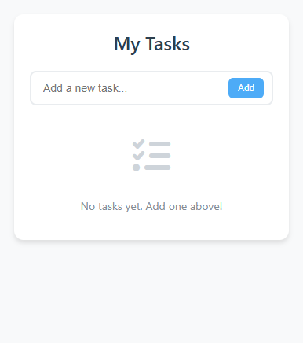

# Clean Todo List Chrome Extension

A beautifully designed, minimal Chrome extension for managing your daily tasks. Built with vanilla JavaScript and styled with modern CSS, this extension offers a clean and intuitive interface for organizing your todos.



## Features

- 🎯 Clean, minimal interface
- 💾 Persistent storage across browser sessions
- ✨ Smooth animations and transitions
- 📱 Responsive design
- ✅ Custom checkbox styling
- 🗑️ Easy task deletion
- 🎨 Modern color scheme
- 🌙 Properly spaced layout
- 📝 Easy task input
- 🔄 Real-time updates

## Installation

### From Source
1. Clone this repository:
```bash
git clone https://github.com/ronanski11/Todo-Extension.git
```

2. Open Chrome and navigate to `chrome://extensions/`

3. Enable "Developer mode" by clicking the toggle in the top-right corner

4. Click "Load unpacked" and select the directory containing the extension files

5. The extension icon should now appear in your Chrome toolbar

## Usage

1. Click the extension icon in your Chrome toolbar to open the todo list
2. Add new tasks:
   - Type your task in the input field
   - Press Enter or click the "Add" button
3. Manage tasks:
   - Click the checkbox to mark a task as complete
   - Hover over a task to reveal the delete button
   - Click the trash icon to remove a task
4. All changes are automatically saved and persist across browser sessions

## Project Structure

```
clean-todo-extension/
├── manifest.json        # Extension configuration
├── popup.html          # Main extension interface
├── popup.js            # Core functionality
├── README.md           # Documentation
└── preview.png         # Extension screenshot
```

## Technical Details

### Local Storage
The extension uses Chrome's `storage.local` API to persist todos. Tasks are stored in the following format:

```javascript
{
  todos: [
    {
      id: number,
      text: string,
      completed: boolean
    }
  ]
}
```

### Styling
- Custom CSS variables for consistent theming
- Font Awesome icons for visual elements
- Responsive design principles
- CSS transitions for smooth interactions
- Modern box-shadow and border-radius for depth

## Development

### Prerequisites
- Google Chrome browser
- Basic knowledge of HTML, CSS, and JavaScript
- Text editor of your choice

### Making Changes
1. Clone the repository
2. Make your desired changes to the source files
3. Test the extension locally:
   - Navigate to `chrome://extensions/`
   - Click "Load unpacked" if you haven't already
   - Click the refresh icon on your extension card
4. Submit a pull request with your changes

### Code Style Guidelines
- Use consistent indentation (2 spaces)
- Follow JavaScript ES6+ conventions
- Keep functions small and focused
- Comment complex logic
- Use semantic HTML elements
- Follow BEM naming convention for CSS classes

## Contributing

Contributions are welcome! Please feel free to submit a Pull Request. For major changes, please open an issue first to discuss what you would like to change.

1. Fork the repository
2. Create your feature branch (`git checkout -b feature/AmazingFeature`)
3. Commit your changes (`git commit -m 'Add some AmazingFeature'`)
4. Push to the branch (`git push origin feature/AmazingFeature`)
5. Open a Pull Request

## License

This project is licensed under the MIT License - see the [LICENSE](LICENSE) file for details.

## Acknowledgments

- Font Awesome for the beautiful icons
- Chrome Extension documentation
- The open-source community

## Support

If you encounter any issues or have feature requests, please file an issue on the GitHub repository.

## Future Improvements

- [ ] Dark mode support
- [ ] Task categories/labels
- [ ] Due dates for tasks
- [ ] Task priority levels
- [ ] Export/import functionality
- [ ] Keyboard shortcuts
- [ ] Task notes/descriptions
- [ ] Multiple todo lists
- [ ] Task search functionality
- [ ] Undo delete action
- [ ] Task reordering
- [ ] Browser sync support

## Author

Ronan Coughlan

Project Link: [https://github.com/ronanski11/Todo-Extension](https://github.com/ronanski11/Todo-Extension)
